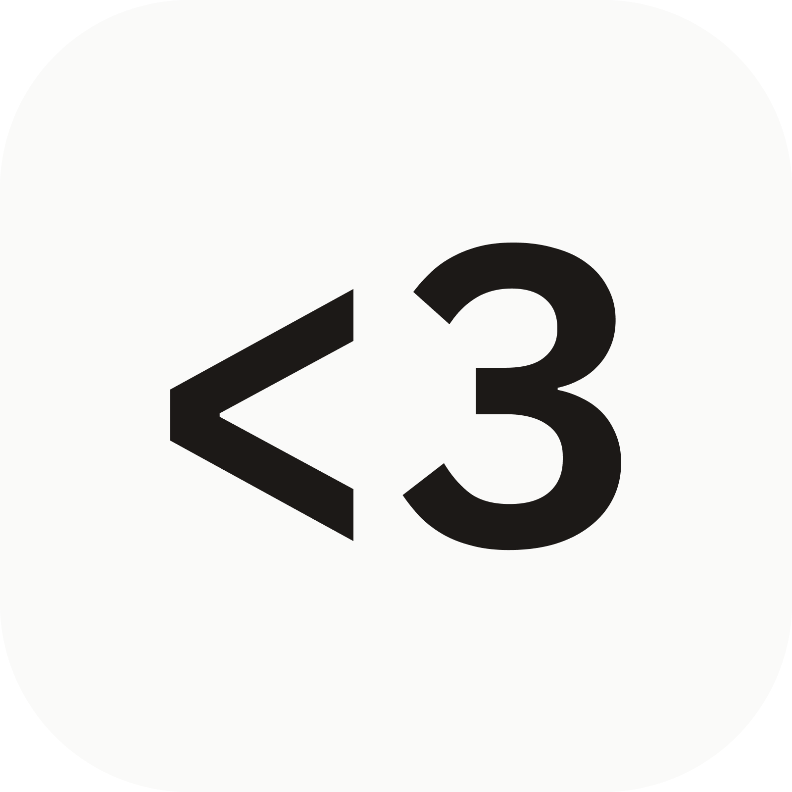

<div align="center">
  
</div>

An app I made for me and my girlfriend to keep track of stuff and share moments together. Built with **Flutter**. 💙

## What we use it for

- 📅 **Shared Calendar**: Keep track of important dates and events together
- 📸 **Stories**: Daily photo dumps of random stuff (🚧 WIP)
- 🌸 **Cycle Tracking**: Track periods and symptoms with AI-generated insights
- 📍 **Location Sharing**: See where the other person is when needed (🚧 WIP)

More features coming soon-ish (depending on what else we'll need from this app)

## Architecture

Built with Flutter and Firebase, using BLoC for state management and dependency injection via `get_it` + `injectable`. The AI insights are powered by Gemini through the `firebase_ai` package. Notable Firebase packages used include `firebase_core`, `firebase_auth`, `cloud_firestore`, `cloud_functions`, `firebase_storage`, `firebase_analytics`, and `firebase_crashlytics`. Media and large uploads (photos/videos) are stored in Cloudflare R2. Other notable packages include `go_router` for navigation, `hive` for local storage, and `super_editor` for rich text editing.

Here is the project's structure:

```
root/
├─ assets/                        # images, fonts, app logo, etc.
├─ android/                       # android project files
├─ ios/                           # ios project files
├─ functions/                     # cloud functions
└─ lib/
  ├── main.dart                   # app entry point
  ├── app/
  │   ├── router/                 # go_router setup
  │   ├── theme/                  # app theming
  │   ├── app_cubit.dart          # global app state management
  │   ├── app_state.dart          # global app state definitions
  │   └── app.dart
  ├── config/
  │   ├── dependencies.dart       # get_it + injectable DI
  │   └── firebase_options.dart   # generated by FlutterFire CLI
  ├── constants/                  # app-wide constants
  ├── data/
  │   ├── hive_adapters/          # hive type adapters
  │   ├── models/                 # data models
  │   ├── repositories/           # data layer abstractions
  │   └── services/               # business logic (AI insights, predictions)
  ├── localizations/              # i18n support
  ├── ui/
  │   ├── features/               # feature modules with BLoC
  │   └── shared_widgets/         # reusable components
  └── utils/                      # extensions, formatters, mixins
```

## Working on this with Claude Code

This project runs on Flutter 3.47.2 / Dart 3.13.2, which is newer than most AI models' training data — so they tend to suggest widgets and APIs that have since been deprecated or removed. The [`dart-sdk-skills`](https://github.com/RandalSchwartz/dart-sdk-skills) plugin fixes that by giving Claude Code a version-by-version reference for both SDKs.

Install it once, from inside Claude Code:

```
/plugin marketplace add RandalSchwartz/dart-sdk-skills
/plugin install dart-sdk-skills@dart-sdk-skills
```

That adds two skills, which load on their own whenever they're relevant:

- **`dart-sdk-changelog`** — Dart language features and core APIs, minimum SDK lookups, experimental flags, macros and augmentations
- **`flutter-sdk-changelog`** — widget deprecations and their replacements (`WillPopScope` → `PopScope`, `withOpacity` → `withValues`, `MaterialState` → `WidgetState`), Material 3 migration, Flutter-to-Dart version matrix

## License

Feel free to explore this project for inspiration and learning! It's licensed under MIT with a Commons Clause, which means you can use, modify, and study the code freely — just not for commercial purposes. See [LICENSE](LICENSE) for details.
