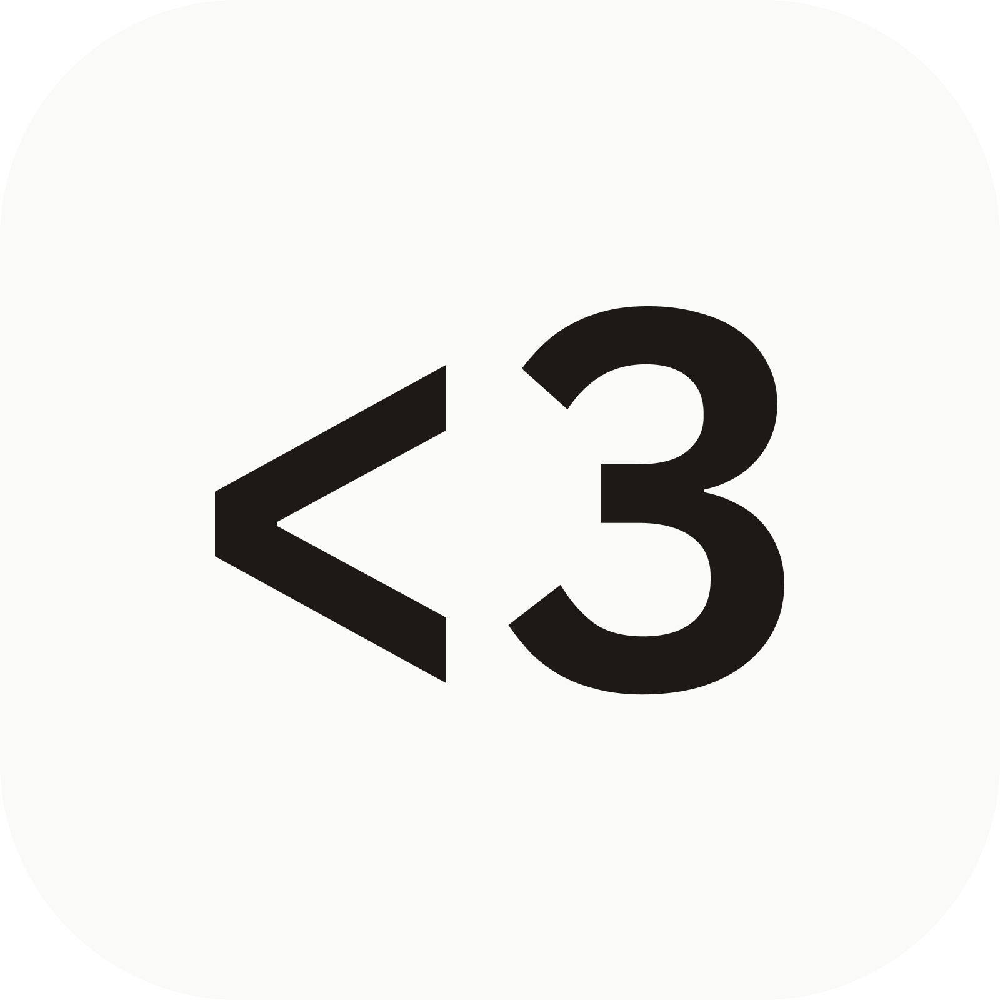

  

# Bebi App

A simple couples app I made for me and my girlfriend to keep track of stuff and share moments together <3

## What it does

- 📅 **Shared Calendar**: Keep track of important dates, events, and appointments together.
- 📸 **Stories**: Instantly share candid photos with your partner (🚧 in progress).
- 🌸 **Cycle Tracking**: Monitor menstrual cycles, log symptoms, and view shared insights and predictions.
- 📍 **Location Sharing**: Share your location with your partner when needed (🚧 in progress).

## App Architecture & Tech Stack

### 🏗️ Architecture

The app follows a clean architecture pattern with clear separation of concerns:

- 🎨 **UI Layer** (`ui/`): Feature-based organization with shared widgets
  - **Features**: Authentication, Profile Setup, Home, Calendar, Cycles, Stories.
  - **Shared Widgets**: Forms, Layouts, Modals, Custom Components.

- 💿 **Data Layer** (`data/`): Models, repositories, and services

  - Models: User profiles, calendar events, cycle logs, symptoms
  - Repositories: Data access abstraction for Firebase and local storage
  - Services: Business logic for cycle predictions, recurring events, app updates

- 📱 **App Layer** (`app/`): Routing, theming, and app-level configuration
- ⚙️ **Config** (`config/`): Dependency injection, Firebase setup, Hive boxes
- 🛠️ **Utils** (`utils/`): Extensions, formatters, analytics, and helper functions

### 🛠️ Tech Stack

- **State Management**: `flutter_bloc`
- **Navigation**: `go_router`
- **Backend**: Firebase (Auth, Firestore, Storage, Analytics), Sentry for error monitoring.
- **Local Storage**: `hive_ce_flutter`
- **Dependency Injection**: `get_it` + `injectable`
- **UI**: `super_editor`, `table_calendar`, `paged_vertical_calendar`, `cached_network_image`, `skeletonizer`
- **AI**: `firebase_ai` for generative features.

### 📝 License

This project is licensed under the MIT License with Commons Clause. See the [LICENSE](LICENSE) file for details.

---

_This project is under active development. Core features are functional with new capabilities being added regularly._
